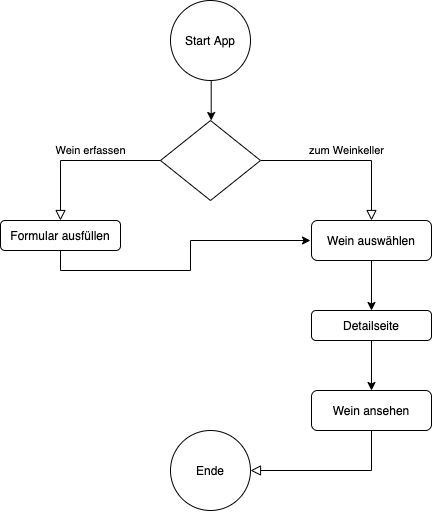

# Projektidee 

## Mein Kalender ist überfüllt und unübersichtlich. Ich trage mir in meinem Standardkalender alle Termine der Schule, der Arbeit und der Freizeit ein. 

Um da Ordnung zu schaffen, möchte ich einen Kalender nur für die Freizeit erstellen. Der Kalender soll einfach und individuell zu bearbeiten sein. Diese Funktionen sollen beachtet werden:

- Vorgegebene Kästchen, die mit Farben und Aktivitäten erstellt und sortiert werden können,
- Speicherung der Kästchen, um diese nochmals verwenden zu können, ohne dass jedes Mal ein neues erstellt werden muss,
- Einfache User Experience, 
- Mitteilungen bei einem bevorstehenden Termin

# Neue Projektidee

## Meine neue Projektidee sollte eine App sein, die einen Überblick über den privaten Weinkeller verschafft. Meine ganze Familie ist sind Weinliebhaber, da sammeln sich gerne auch einige Flaschen im Keller an. 

Ich möchte ein App für den Weinkeller für den Haushalt erstellen. Die Daten sollten einfach zu erfassen sein und eine übersichtliche Oberfläche zeigen. Die Funktionen sollten beinhalten:

Dateneingabe:
-	Formular zum Ausfüllen mit Daten des Weines. Name, Geschmack etc.
-	Persönliche Bewertung abgeben.

Weinkeller filtern und suchen:
-	Gesuchter Wein gibt an, zu welchem Gericht dieser passt.
-	Gekochtes Essen kann eingegeben werden und der passende Wein wird angezeigt. 

Nachrichten:
-	Der Wein hat sein perfektes Datum, um getrunken zu werden, erreicht. 
-	Timer um zu sehen, wie lange der Wein offen stehen oder gekühlt werden muss.

# Finale Projektidee 
Meine Projektidee ist eine App, die einen Überblick über den privaten Weinkeller verschafft. Meine ganze Familie sind Weinliebhaber, da sammeln sich gerne auch einige Flaschen im Keller an. 
Mithlfe des Apps können die geschenkten oder gekauften Weine einfach erfasst werden und gibt so einen Überblick über seine Eigene Weinsammlung.

#Ausgangslage
Im Modul Programmieren 2 sollte dieses Semester eine Webapplikation mit Pyhton erstellt werden, die es ermöglicht, Daten einzugeben, zu speicher und auszugeben. Ebenfalls werden auch die Module wie Jinja, Flask und Plotly benutzt.
Die Webapplikaiton ist funktional und einfach aufgebaut und ermöglicht durch klicken der Buttons und Links auf die verschiedenen Seiten zu gelangen.

#Workflow
Beim Aufrufen der URL wird zuerst meine Startseite angezeigt. Dort kann zwischen "Wein erfassen" und "mein Weinkeller" ausgewählt werden.
Möchte man einen neuen Wein erfassen, kann man auf den Button klicken oder aber auch den Link in der Navigation benutzen.
Auf der Seite "erfassen" kann mit dem Abschicken des Formular die Daten des Weines erfasst werden. Sobald das Formular geschickt wird, gelangt man automatisch auf die Übersichtsseite der Weine.
Auf der Seite "weinkeller" sind dann alle erfassten Weine ersichtlich. Für jeden Wein können die Details durch Klicken des Buttons angeschaut werden.
Die Detailseite erhält noch zusätzliche Informationen über den Wein.

#Funktionen
Dateneingabe des Users:
-	Formular zum Ausfüllen mit Daten des Weines: Name, Geschmack, Preis, Herkunft, Jahrgang, Sorte, Persönliche Bewertung

Datenverarbeitung, Speicherung
-   Die eingegebenen Daten aus dem Formular werden in der Datenbank gespeichert.

Datenausgabe:
-   Die eingegebenen Weine werden in einer Übersichtseite angezeigt. 
-   Die Detailseiten der Weine gibt die eingegebenen Daten des Weines aus.

Mögliche Erweiterbarkeiten:

Da das Projekt noch weiter ausgebaut werden kann, sind hier noch einige Ideen aufgeschrieben, die mit mehr Wissen und Zeit ebenfalls noch eingebaut werden könnten.
-   Einkaufliste erstellen. Falls nur noch wenige Weine vorhanden sind, wird es eine Mitteilung geben.
-   Eine Pushnachricht wird gesendet, wenn der Wein sein perfektes Datum, um getrunken zu werden, erreicht hat. 
-	Es wird eine Pushnachricht mit dem Hinweis gesendet, wie lange dieser Wein gekühlt oder offen stehen muss.
-	In der Detailansicht zeigt der gesuchte Wein zu welchem Gericht dieser passt.
-	Gekochtes Essen kann eingegeben werden und die passenden Weine werden angezeigt.
-   Die Weine können mit einer Filterfunktion gesucht werden.

Amanda Tröhler 
DBM19TZ